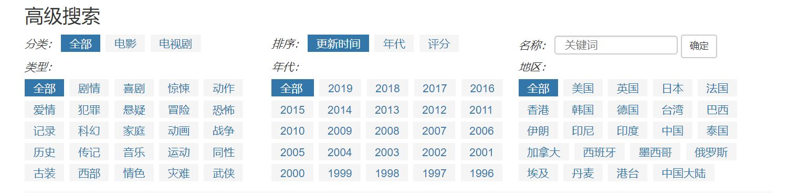

## 关于电影资源网站(看官网*kanguan*)的相关需求分析

```
	此项目为我的毕业设计项目，打算做一个电影资源网站，搜集众多电影的BT资源共广大网友使用和观看
```


*编辑：* ZSS 

*项目名称：*待定

*修改时间：*2020-03-15


---


### 基本需求


1. 上传电影信息，包括电影相关信息，涵盖如下信息：

    电影名称、编剧、主演、类型、国家/地区、上映时间、片长、又名、评分(豆瓣)

2. 上传电影资源：主要是磁力链接

3. 上传外国电影的外挂字幕

4. 电影检索，大概样子如下：

    

5. 展示电影资源（包括已有的和将要放出资源的电影）

    

### 其他需求

1. 充值成为VIP，可观看更多资源（后面发展）
2. 求资源
3. 意见与投诉


### 数据库设计 

```
数据库名称：kanguan ; 数据库表名前缀：kg_
```

#### 表名

* 账户表（account）
* 用户信息表 (user information)
* 管理员表 (admin)
* 影视剧表 (movies)
* 资源表 (resource)
* 字幕表 (subtitle)
* 订阅表 (subscription)
* 评论表 (comment)
* 反馈表 (feedback)
* 求资源 (request)
* 热门推荐 (hot)

#### 详细设计

* 账户表 (kg_account)

~~~~sql
create table kg_account (
    account_id varchar2(100) primary key,
	username varchar2(50),
    password varchar2(100),
    email varchar2(50)，
    create_time varchar2(20),
    update_time varchar2(20)
);

# 加注释
comment on table kg_account is '账户表';
comment on column kg_account.username is '用户名';
comment on column kg_account.password is '密码';
comment on column kg_account.email is '邮箱';
comment on column kg_account.create_time is '创建时间';
comment on column kg_account.update_time is '更新时间';
~~~~

* 用户信息表 (kg_user_info)

```sql
create table kg_user_info (
	info_id varchar2(100) primary key,
   	member varchar2(10),
    create_time varchar2(20),
    update_time varchar2(20)  
);

# 加注释
comment on table kg_user_info is '用户信息表';
comment on column kg_user_info.member is '是否会员';
```

* 管理员表 (kg_admin)

```sql
create table kg_admin (
	admin_id varchar2(100) primary key,
    admin_name varchar2(50),
    password varchar2(100),
    create_time varchar2(20),
    update_time varchar2(20)
);

# 加注释
comment on table kg_admin is '管理员表';
comment on column kg_admin.admin_name is '管理员名称';
comment on column kg_admin.password is '管理员密码';
```

* 影视剧表 (kg_movies)

```sql
create table kg_movies (
	movie_id varchar2(100) primary key,
    name varchar2(100),
    cover varchar2(255),
    director varchar2(400),
    scenarist varchar2(255),
    staring varchar2(255),
    style varchar2(50),
    type number,
    country_regin varchar2(100),
    premiere varchar2(20),
    release varchar2(255),
    length varchar2(20),
    another_name varchar2(255),
    score number(2,1),
    introduction varchar2(1500),
    create_time varchar2(20),
    update_time varchar2(20)
);

# 加注释
comment on table kg_movies is '影视剧信息表';
comment on column kg_movies.name is '名称';
comment on column kg_movies.cover is '封面';
comment on column kg_movies.director is '导演';
comment on column kg_movies.scenarist is '编剧';
comment on column kg_movies.staring is '主演';
comment on column kg_movies.style is '类型';
comment on column kg_movies.type is '电影/电视剧，1 是电影，0 是电视剧';
comment on column kg_movies.country_regin is '国家/地区';
comment on column kg_movies.premiere is '首映时间';
comment on column kg_movies.release is '上映时间';
comment on column kg_movies.length is '片长';
comment on column kg_movies.another_name is '又名';
comment on column kg_movies.score is '评分';
comment on column kg_movies.introduction is '简介';
```

* 资源表 (kg_resource)

```sql
create table kg_resource (
	resource_id varchar2(100) primary key,
    name varchar2(100),
    episode varchar2(8)，
    bigness varchar2(10),
    format varchar2(10),
    download_link varchar2(1000),
    object varchar2(100),
    create_time varchar2(20),
    update_time varchar2(20)
);

# 加注释
comment on table kg_resource is '资源表';
comment on column kg_resource.name is '资源名称';
comment on column kg_resource.episode is '集数';
comment on column kg_resource.bigness is '大小';
comment on column kg_resource.format is '格式';
comment on column kg_resource.object is '资源对象';
comment on column kg_resource.download_link is '资源链接';
```

* 字幕表 (kg_subtitle)

```sql
create table kg_subtitle (
	subtitle_id varchar2(100) primary key,
    name varchar2(100),
    language varchar2(100),
    format varchar2(10),
    episode varchar2(8)，
    download varchar2(255),
    target_id varchar2(100),
    create_time varchar2(20),
    update_time varchar2(20)
);

# 加注释
comment on table kg_subtitle is '字母表';
comment on column kg_subtitle.name is '字幕名称';
comment on column kg_subtitle.language is '语言';
comment on column kg_subtitle.format is '格式';
comment on column kg_subtitle.episode is '集数';
comment on column kg_subtitle.download is '下载地址';
comment on column kg_subtitle.target_id is '资源对象';
```

* 订阅表 (kg_subscription)

```sql
create table kg_subscription (
	sub_id varchar2(100) primary key,
    sub_object varchar2(100),
    subscriber varchar2(100),
    create_time varchar2(20),
    update_time varchar2(20)
);

# 加注释
comment on table kg_subscription is '订阅表';
comment on column kg_subscription.sub_object is '订阅对象';
comment on column kg_subscription.subscriber is '订阅者';
```

* 评论表 (kg_comment)

```sql
create table kg_comment (
	comment_id varchar2(100) primary key,
    commentator varchar2(100),
    content varchar2(1000),
    target_id varchar2(100),
    create_time varchar2(20),
    update_time varchar2(20)
);

# 加注释
comment on table kg_comment is '评论表';
comment on column kg_comment.commentator is '评论人';
comment on column kg_comment.content is '评论内容';
comment on column kg_comment.target_id is '评论的对象';
```

* 反馈表 (kg_feedback)

```sql
create table kg_feedback (
	feedback_id varchar2(100) primary key,
    content varchar2(500),
    feedback_person varchar2(100),
    read number,
    create_time varchar2(20),
    update_time varchar2(20)
);

# 加注释
comment on table kg_feedback is '反馈表';
comment on column kg_feedback.content is '反馈内容';
comment on column kg_feedback.feedback_person is '反馈对象';
comment on column kg_feedback.read is '阅读状态';
```

* 求资源 (kg_request)

```sql
create table kg_request (
	request_id varchar2(100) primary key,
    douban_address varchar2(100),
    name varchar2(100),
    exist varchar2(100),
    requester varchar2(100),
    create_time varchar2(20),
    update_time varchar2(20)
);

# 加注释
comment on table kg_request is '求资源';
comment on column kg_request.douban_address is '豆瓣地址';
comment on column kg_request.name is '资源名称';
comment on column kg_request.exist is '是否已收录，1 已收录，0 未收录';
comment on column kg_request.requester is '请求者';
```

* 热门推荐 (kg_hot)

```sql
create table kg_hot (
	hot_id varchar2(100) primary key,
	object varchar2(100),
    type number,
    create_time varchar2(20),
    update_time varchar2(20)
);

# 加注释
comment on table kg_hot is '热门推荐';
comment on column kg_hot.object is '推荐对象';
comment on column kg_hot.type is '电视剧/电影';
```


#### 创建表空间&用户

表空间名：**kanguan_data**

用户名：**kanguan**

密码：**kanguan_Kk6neiid**


* 创建临时表空间 (kanguan_temp)

```sql
create temporary tablespace kanguan_temp
tempfile '临时表空间存放目录'
size 50m
autoextend on
next 50m maxsize 20480m
extent management local;
```

* 创建表空间 (kanguan_data)

```sql
create tablespace kanguan_data
logging
datafile '表空间存放目录'
size 50m
autoextend on
next 50m maxsize 20480m
extent management local;
```

* 创建用户 (kanguan)

```sql
create user c##kanguan identified by kanguan_Kk6neiid
default tablespace kanguan_data
temporary tablespace kanguan_temp;

# 用户权限
grant connect,resource,dba to c##kanguan;

# 查询当前用户下所有的表
select table_name from user_tables;
```

